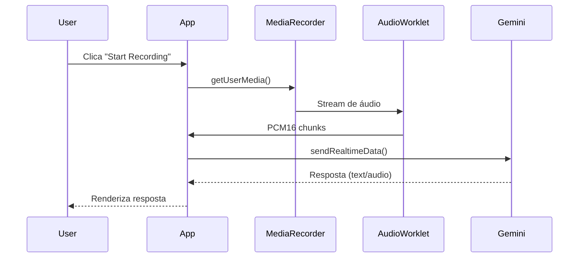
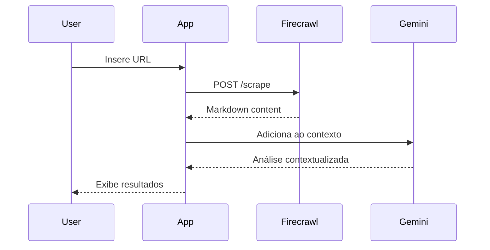
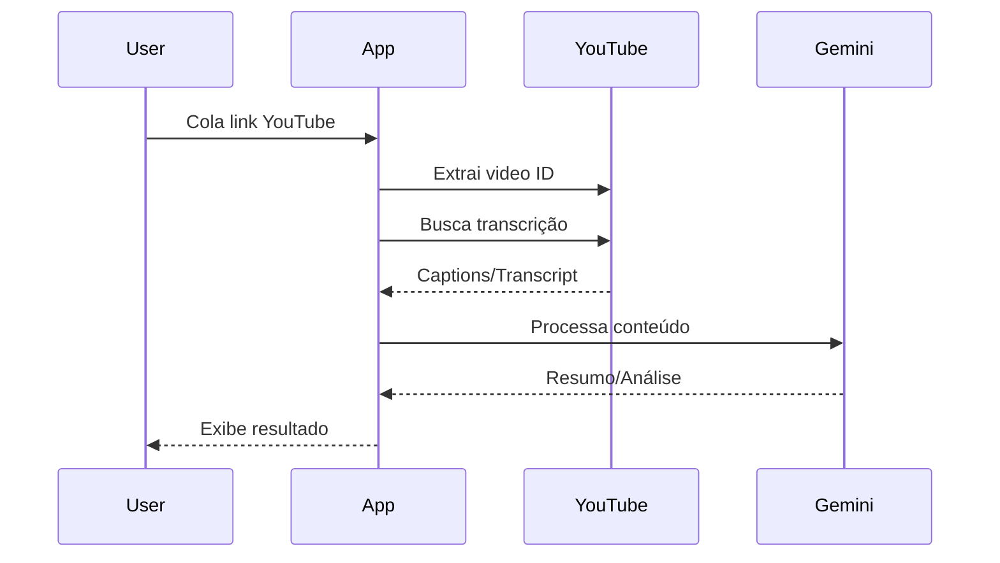

# 🔄 API Flows - Live Audio AI Assistant

## 📊 Fluxos de Integração

### 1. Fluxo de Áudio em Tempo Real



### 2. Fluxo de Análise de URL



### 3. Fluxo de Análise YouTube



## 🔐 Configuração das APIs

### Gemini API

**Endpoint**: `wss://generativelanguage.googleapis.com`

**Modelo**: `gemini-2.0-flash-exp`

**Configuração**:
```typescript
{
  model: "models/gemini-2.0-flash-exp",
  systemInstruction: {
    parts: [{
      text: "Você é um assistente útil..."
    }]
  },
  generationConfig: {
    responseModalities: "audio",
    speechConfig: {
      voiceConfig: { prebuiltVoiceConfig: { voiceName: "Aoede" } }
    }
  }
}
```

### Firecrawl API

**Endpoint**: `https://api.firecrawl.dev/v1/scrape`

**Headers**:
```typescript
{
  'Content-Type': 'application/json',
  'Authorization': `Bearer ${FIRECRAWL_API_KEY}`
}
```

**Payload**:
```typescript
{
  url: string,
  pageOptions: {
    onlyMainContent: true
  }
}
```

## 📈 Tratamento de Erros

### Estratégias de Retry
- **Gemini**: 3 tentativas com backoff exponencial
- **Firecrawl**: 2 tentativas com timeout de 30s
- **YouTube**: Fallback para extração manual

### Códigos de Erro

| API | Código | Ação |
|-----|--------|------|
| Gemini | 429 | Rate limit - aguardar 60s |
| Gemini | 401 | API key inválida |
| Firecrawl | 402 | Limite de créditos |
| Firecrawl | 500 | Retry após 5s |

## 🚀 Otimizações

### Cache
- Respostas do Firecrawl: 1 hora
- Transcrições YouTube: 24 horas
- Contexto Gemini: Por sessão

### Rate Limiting
- Gemini: 60 requests/min
- Firecrawl: 100 requests/hora
- YouTube: Sem limite oficial

## 📊 Métricas

### Latências Médias
- **Gemini Audio**: 50-200ms
- **Firecrawl Scrape**: 2-10s
- **YouTube Transcript**: 1-3s

### Taxa de Sucesso
- **Gemini**: 99.5%
- **Firecrawl**: 95%
- **YouTube**: 90%